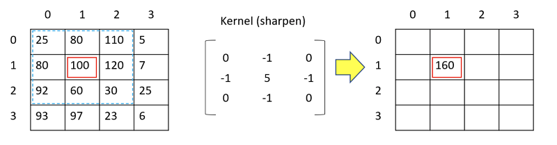

# PhotoLab v1.0

> При старте работы над проектом просим вас постараться хронометрировать время работы над проектом.
> По завершении работы над проектом просим вас ответить на два вопроса [в этом опросе](https://forms.gle/Ew9enegZZqgfujCX7)

Реализация проекта PhotoLab v1.0

## Contents

1. [Chapter I](#chapter-i) \
   1.1. [Introduction](#introduction)
2. [Chapter II](#chapter-ii) \
   2.1. [Information](#information)
3. [Chapter III](#chapter-iii) \
   3.1. [Part 1](#part-1-реализация-простых-фильтров-photolab-v10) \
   3.2. [Part 2](#part-2-реализация-фильтров-свертки-photolab-v10) \
   3.3. [Part 3](#part-3-дополнительно-реализация-цветокоррекции)

## Chapter I

> Фильтр (от лат. filtrum — "войлок") — устройства, созданные для отделения чего-то от чего-то. Например, механизмы, выделяющие (или удаляющие) из данного исходного объекта некоторую часть с заранее заданными свойствами. \
> *У этого термина существуют и другие значения, см. Фильтр.*

*Далее*

*-- ...Для очистки воды самым распространённым способом является использование фильтра кувшина. Он не требует никакого монтажа, легко заменяется...*

*Пропустить*

*-- ...Картон самый распространенный материал для воздушных фильтров. Однако, в некоторых странах сменные элементы делают из синтетических волокон. Эксплуатация...*

*Пропустить*

> Принцип работы биологического фильтра (биофильтра) основан на естественной способности живых микроорганизмов (бактерии, растения) извлекать и/или перерабатывать из проходящих сквозь них примеси органических и неорганических летучих веществ. Это включает в себя органические вещества искусственного происхождения, окисление и разложение их до воды и углекислого газа.

*Далее*

> Фильтрация применяется также и для компьютерных изображений. Под фильтрацией в данном случае понимают операцию, имеющую своим результатом изображение того же размера, полученное из исходного по некоторым правилам (фильтрам).

Под данным определением можно было увидеть множество картинок, что определенно привлекло ваше внимание. Они изображали результаты работы различных фильтров: от черно-белых и контрастных, до размытых и абстрактных.

*- Видимо именно так видят мир близорукие люди, интересно*, - подумали вы глядя на размытое изображение человека на фоне напоминающим нечто вроде Эйфелевой башни. - *Необходимо изучить механизмы и возможности реализации.*

## Introduction

В данном проекте вам необходимо реализовать программу для наложения различных фильтров свертки (англ. convolution filter) на изображение. Такие фильтры используются для размытия изображения, повышения четкости, контурирования, создания эффекта барельефа и наложения многих других различных эффектов.

## Chapter II

## Information

Как вы уже поняли, работая над проектами вьювера трехмерных моделей, любое растровое изображение является матрицей пикселей. Каждый пиксель имеет свой цвет. В некоторых случаях возникает потребность наложить на изображение некоторый эффект. Такой процесс называется фильтрацией изображения, потому что каждый пиксель (растр) изображения проходит через некоторый вычислительный фильтр. Конечно же, можно просто умножить, например, на 2 интенсивность красного канала каждого растра, и будет получено немного более красное изображение. Но абсолютно очевидно, что такими фиксированными фильтрами особого ничего не добиться. Но какие переменные аргументы, зависящие от каких-то атрибутов каждого растра, можно использовать для попиксельной фильтрации?

Для фильтрации методом свертки предлагается использовать цвета соседних пикселей. Такой инструмент является намного более мощным, и как вы увидите в результате, позволяет применять широкий спектр эффектов к изображениям. Конечно, фильтрация методом свертки - это лишь некоторый алгоритм, а структура самой свертки определяет эффект, накладываемый на изображение.

**Свертка** или **ядро фильтра** (англ. filter kernel) - это некоторая весовая матрица, как бы накладываемая поверх матрицы на растр _i,j_ основного изображения таким образом, чтобы центральный элемент матрицы совпадал с растром на позиции _i,j_ основного изображения. Каждый элемент ядра фильтра не только определяет какие пиксели влияют на цвет _i_-ого _j_-ого пикселя, но и отвечают за вес, то есть насколько сильно данный элемент ядра влияет на _i_-ый _j_-ый растр. Применяя одну и ту же формулу, но со смещенной сверткой, для каждого пикселя изображения получаются новые значения цвета пикселей которые заносятся уже в матрицу отфильтрованного изображения.

Формально формула выглядит так:

$`b_{i,j} = \sum^{m}_{p=0} \sum^{n}_{q=0} a_{i-(m-1)/2+p , j-(n-1)/2+q} \cdot k_{p,q}`$,

где $`a_{i,j}`$ - элемент исходного изображения,

$`b_{i,j}`$ - элемент отфильтрованного изображения,

$`k_{i,j}`$ - элемент ядра фильтра,

$`m, n`$ - ширина и высота ядра фильтра

На практике это означает, что цвет каждого пикселя равен сумме соответственно перемноженных части растров исходного изображения и элементов ядра фильтра.

Лишь изменяя саму свертку, то есть размер матрицы и ее содержимое, можно добиваться совершенно разных эффектов. С примерами сверток можно ознакомиться в **материалах**.

## Chapter III

## Part 1. Реализация простых фильтров PhotoLab v1.0

Необходимо реализовать программу PhotoLab v1.0:

- Программа должна быть разработана на языке C++ стандарта C++17
- Код программы должен находиться в папке src
- При написании кода необходимо придерживаться Google Style
- Классы должны быть реализованы внутри пространства имен `s21`
- Подготовить полное покрытие unit-тестами модулей, реализующих бизнес-логику приложения, c помощью библиотеки GTest
- Сборка программы должна быть настроена с помощью Makefile со стандартным набором целей для GNU-программ: all, install, uninstall, clean, dvi, dist, tests. Установка должна вестись в любой другой произвольный каталог
- Реализация с графическим пользовательским интерфейсом, на базе любой GUI-библиотеки с API для C++17: Qt, SFML, GTK+, Nanogui, Nngui и т. д.
- Программа должна быть реализована с использованием паттерна MVC, а также:
    - не должно быть кода бизнес-логики в коде представлений
    - не должно быть кода интерфейса в контроллере и в модели
    - контроллеры должны быть тонкими
- Нельзя использовать готовые библиотеки, реализующие фильтрацию или работу с матрицами, за исключением разработанной вами ранее библиотеки `s21_matrix`
- Программа должна предоставлять возможность:
    - Загружать произвольное изображение формата BMP
    - Сохранить результат фильтрации в отдельный файл (формат BMP)
    - Применить фильтр из пула готовых фильтров:
        - Обесцвечивание (без использования свертки)
        - Негатив (без использования свертки)
        - Тонирование (по аналогии с обесцвечиванием, но в оттенках указанного на палитре цвета. В палитре должно быть минимум 16 разных цветов. Палитра реализуется произвольным образом)
- После применения фильтрации результат должен быть отображен в пользовательском интерфейсе вместе с исходным изображением

## Part 2. Реализация фильтров свертки PhotoLab v1.0

Необходимо модифицировать программу PhotoLab v1.0 с целью реализации фильтров свертки:

- Программа должна предоставлять возможность применять на изображение следующие фильтры свертки:
    - Барельеф (Emboss)
    - Повышение резкости (Sharpen)
    - Блочное размытие (Box blur)
    - Гауссово размытие (Gaussian blur)
    - Фильтр Лапласа (Laplacian filter)
    - Фильтр Прюитта (Prewitt filter) или Фильтр Собеля (Sobel filter)
- Программа должна предоставлять возможность вводить произвольную матрицу ядра фильтра (размером до 16x16) вручную через отдельное диалоговое окно

## Part 3. Дополнительно. Реализация цветокоррекции

Необходимо модифицировать программу PhotoLab v1.0 с целью реализации алгоритмов цветокоррекции:

- Программа должна предоставлять возможность осуществлять настройку цветокоррекции, а именно:
    - изменение яркости и контрастности изображения
    - работа с насыщенностью для всего изображения (по моделям HSL и HSV)
- Интерфейс для цветокоррекции исходного изображения должен предоставлять возможность задания яркости, контрасности и трех параметров указанной модели насыщенности как числом, так и слайдером.
